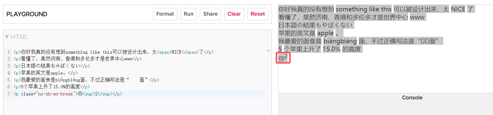

# ZhEnTextFormatter 中英混排空隙添加器

[](LICENSE)
[](https://github.com/martinSCS/ZhEnTextFormatter/releases)
[](https://github.com/martinSCS/ZhEnTextFormatter/actions)

## 项目描述

**ZhEnTextFormatter** 是一个轻量级的 JavaScript 插件，旨在优化中英文混排文本的排版。它通过在中英文字符之间自动插入空隙，改善文本的可读性。该插件特别适合处理包含中日韩（CJK）字符的网页内容，使混排文本的显示更加美观。

## 特性

- **自动检测**：自动检测中英文字符的切换处，插入空隙。
- **支持多种字符**：支持包括中文、日文假名、韩文谚文、CJK标点等在内的多种 CJK 字符或全角字符。
- **自定义样式**：允许用户通过 CSS 自定义空隙宽度。
- **灵活禁用**：提供了灵活的机制，允许在特定区域禁用效果。
- **只针对行内元素**：效果只针对行内元素，段间元素之间不做处理。不处理 HTML 中的换行和缩进用的 `TEXT_NODE`。

## 安装和使用

### 1. 引入插件

**方法 1**：使用 npm 包管理工具：

```shell
npm i zhentextformatter
```

**方法 2**：将插件的 JavaScript 文件和 CSS 文件引入你的项目中。例如，在HTML文件中：

```html
<link rel="stylesheet" href="https://cdn.jsdelivr.net/gh/martinSCS/ZhEnTextFormatter/break.css">
<script src="https://cdn.jsdelivr.net/gh/martinSCS/ZhEnTextFormatter/formatter.js"></script>
```

或

```html
<link rel="stylesheet" href="https://cdn.jsdelivr.net/npm/zhentextformatter/break.css">
<script src="https://cdn.jsdelivr.net/npm/zhentextformatter/formatter.js"></script>
```

### 2. 使用插件

在页面加载完成后调用插件，让它处理页面中的文本：

```javascript
document.addEventListener('DOMContentLoaded', function() {
  addZhEnBreaks(document.body)
});
```

### 3. 自定义样式

如果你想在某些元素中禁用空隙效果，只需在该元素上添加 `no-zh-en-break` 类：

```html
<div class="no-zh-en-break">
    <p>这段text不会被自动插入空隙。</p>
</div>
```

## 示例

以下是插件处理后的文本示例：



在示例中，插件自动在中英文字符之间插入了空隙，使文本显示更为舒适；同时也**不会向文本中添加空格**影响用户复制结果。同时 `.no-zh-en-break` 类也有效地避免了空隙的出现。

## 贡献指南

我们欢迎并感谢任何形式的贡献。如果你有任何改进建议或发现了问题，欢迎提交 Issue 或 Pull Request 。

### 如何贡献

1. **Fork** 这个仓库。
2. **创建一个新分支** 用于你的功能或修复 (`git checkout -b feature-branch`)。
3. **提交你的改动** (`git commit -am 'Add new feature'`)。
4. **推送到分支** (`git push origin feature-branch`)。
5. **创建一个新的 Pull Request**，并描述你的更改。

## 常见问题

### 为什么要使用这个插件？
使用 `ZhEnTextFormatter` 可以显著改善中英文混排文本的可读性，特别是在多语言网站或应用中，这有助于提升用户体验。

### 插件对性能有影响吗？
`ZhEnTextFormatter` 是一个轻量级插件，对大多数网页来说性能影响可以忽略不计。它在页面加载完成后运行，只处理必要的文本节点。

## 许可证

这个项目使用 [MIT 许可证](LICENSE)，意味着你可以自由使用、修改和分发这个插件。

## 联系方式

如果你有任何问题或建议，请通过以下方式联系我：

- **Email**: martinscsjt@gmail.com
- **GitHub Issues**: [issues page](https://github.com/martinSCS/ZhEnTextFormatter/issues)
- **Twitter**: [@thisisMartin](https://twitter.com/thisisMartin)
